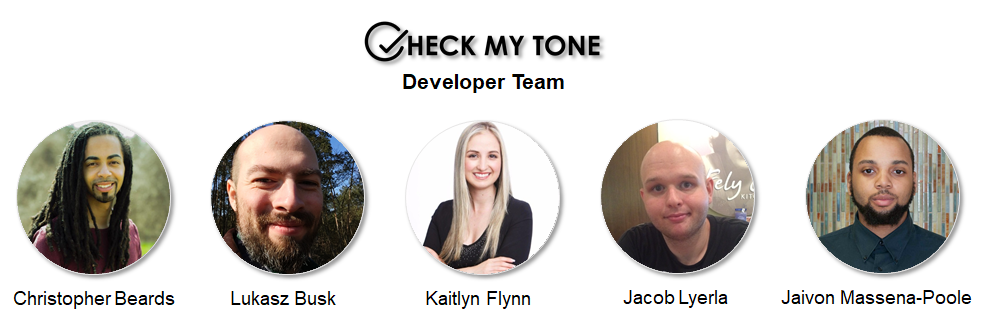

# CS9-DontSendThatEmail (Check My Tone)
How many times have you written an email or other communication and spent a significant amount of time worrying about how your intended audience would interpret your message? Maybe you worried it would come across as too angry, too analytical or had a target objective in mind and wanted to be sure you were optimizing your tone in such a way to achieve your desired outcome. With "Check My Tone", you can create your written communications with confidence as the Watson Tone Analyzer utilizes deep linguistic analytic technology, providing you with an automated way to detect and understand the present tones in your messages. "Check My Tone" - the key to refining and improving your tone to help you achieve more impactful communication results!   

## Deployment
* Netlify: https://dont-email-us.netlify.com/
* Heroku: https://dontemail.herokuapp.com/

## Built With
For this application we implemented the MERN Stack which is a set of Open Source components that together, provide an end-to-end framework for building a dynamic web application. This application is completely written in JavaScript.  

* [MongoDB](https://www.mongodb.com/what-is-mongodb) - Document database offering scalability, flexibility, querying and indexing
* [Express.js](https://expressjs.com/) - Web framework
* [React](https://reactjs.org/) - JavaScript library for building user interfaces
* [Node.js](https://nodejs.org/en/about/) - JavaScript run-time server environment
* [IMB Watson Tone Analyzer](https://console.bluemix.net/docs/services/tone-analyzer/index.html#about) - Tone Analyzer using linguistic analysis to detect emotional/language tones in written text
* [Reactstrap](https://reactstrap.github.io/) - React UI Component Framework
* [React Context API](https://reactjs.org/docs/context.html) - Production-grade, efficient API
* [Stripe](https://stripe.com/about) - Technology company with banking infrastructure to operate on-line payment systems
* [Passport](http://www.passportjs.org/) - Authentication middleware for Node
* [Passport-JWT](https://www.npmjs.com/package/passport-jwt) - Passport strategy for authenticating with JSON Web Token
* [Axios](https://github.com/axios/axios) - Promise based HTTP client for browser and node.js
* [Bootstrap](https://getbootstrap.com/) - Open source toolkit 
* [FontAwesome](https://fontawesome.com/v4.7.0/icons/) - Icons used throughout website
* [Validator.js](https://www.npmjs.com/package/validator) - Library of string validators and sanitizers
* [React Router DOM](https://www.npmjs.com/package/react-router-dom) - DOM bindings for React Router

## Authors

 

* [Christopher Beards](https://www.linkedin.com/in/christopher-beards-1292b529/) 
* [Lukasz Busk](https://www.linkedin.com/in/%C5%82ukasz-bu%C5%9Bk-75313b16a/) 
* [Kaitlyn Flynn](https://www.linkedin.com/in/kaitlynflynn/)
* [Jacob Lyerla](https://www.linkedin.com/in/jacob-lyerla-38946334/)
* [Jaivon Massena-Poole](https://www.linkedin.com/in/jaivonmassena/)

## License
This project is licensed under MIT License
 
Copyright (c) 2018 Lambda Labs  
 
 
Stock photos used for this project:
  

From PEXELS
* [Keyboard Stock Photo](https://www.pexels.com/photo/closeup-photo-of-black-and-blue-keyboard-1194713/) - photo credit by Marta Branco
* ['How It Works' Stock Photo](https://www.pexels.com/photo/sunset-storm-sun-rocks-34090/) - photo credit by Negative Space

From Unsplash
* [Hands on Keyboard Stock Photo](https://unsplash.com/photos/I_pOqP6kCOI) - photo credit by freestocks.org