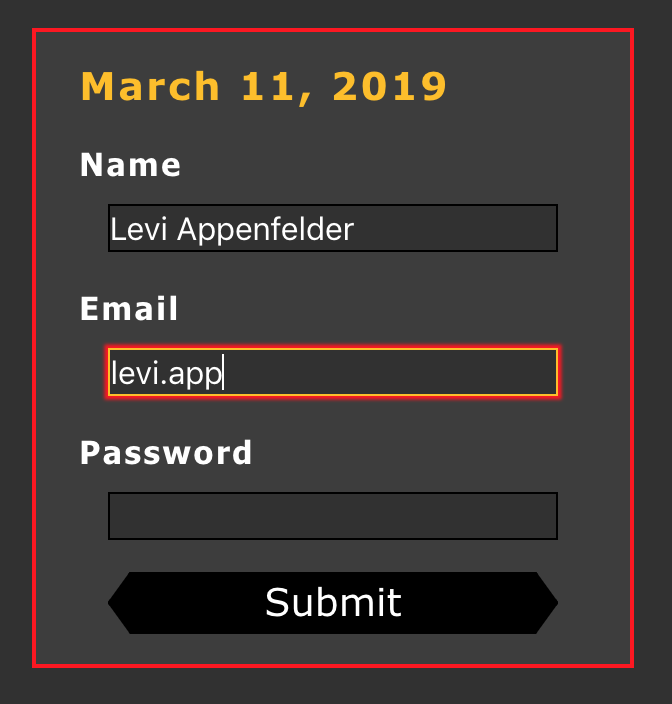
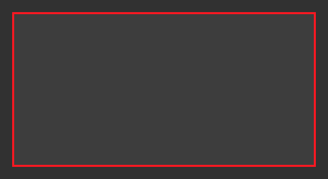
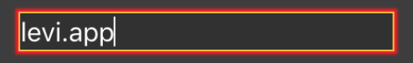
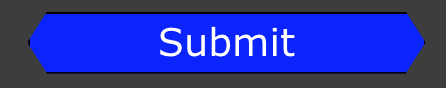

## Basic Style

---

---

`This is how I envision the big picture layout.`

---

---

#### **.App** `The overarching div`

- #### **.main** `The main div of each webpage`

  - #### **.component-container** `The div that houses smaller components`

    - #### **.form-container** `The most basic div that houses all of the individual elements`

---

---

---

---

### Main Page Container For Dark Mode

#### **.main**

- #### **@include main-dm('flex-direction')**

  - #### **display: flex**

  - #### **flex-direction: row**

  - #### **padding: 2.5%**

  - #### **justify-content: center**

  - #### **width: 100%**

---

---

### .events-container

    @include heading-dm()

    * display: flex;
    * flex-direction: column
    * align-items: center
    * box-sizing: border-box
    * width: 35%

---

---

       

          <h1> {this.props.changeDate(this.props.months, this.props.date)} </h1>

          <form>
            <label>Name</label>
            <input type="text"></input>
            <label>Email</label>
            <input type="text"></input>
            <label>Password</label>
            <input type="text"></input>
        </form>

        <button className='submit'>Submit</button>

        

---

---

---

---

### Main Form Container For Dark Mode

#### **.form-container**

- @include form-container-dm()

    * #### **display: flex** ####

    * #### **flex-direction: column** ####

    * #### **align-items: center** ####

    * #### **box-sizing: border-box** ####

    * #### **max-width: 450px** ####

    * #### **width: 100%** ####

    * #### **background-color: $dark-gray (#3D3D3D)** ####

    * #### **margin: 5%** ####

    * #### **padding: 2.5%** ####

    * #### **border: 2px solid $primary-color (#FF1010)** ####

---

---

---

---

### Heading Style For Dark Mode

#### **h1**

- #### **@include heading-dm()**

  - #### **font-family: Verdana, Tahoma,   sans-serif**

  - #### **align-self: flex-start**

  - #### **font-size: \$heading-size (1.5rem)**

  - #### **font-weight: bold**

  - #### **color: \$secondary-color (#FFBF00)**

  - #### **letter-spacing: 0.1rem**

  - #### **margin: 10px 5% 10px 5%**

---

---

### Form Style For Dark Mode

#### **form**

- #### **width: 100%**

---

---

---

---

### Label Style For Dark Mode

#### **label**

- #### **@include label-dm()**

  - #### **display: flex**
  - #### **font-size: \$paragraph-size (1.25rem)**
  - #### **color: \$main-background (white)**
  - #### **font-family: Tahoma, Verdana,   sans-serif**
  - #### **font-weight: bold**
  - #### **letter-spacing: 0.1rem**
  - #### **margin: 10px 5% 10px 5%**

---

---

---

---

### Input Style For Dark Mode

#### **input[type=text]**

- #### **@include form-input-dm()**

      * #### **background-color: $background-gray (#313131)** ####

      * #### **font-size: $heading-size (1.5rem)** ####

      * #### **color: $main-background (white)** ####

      * #### **width: 80%** ####

      * #### **margin-bottom: 10px** ####

      * #### **border: 0.5px solid $text-color (black)** ####

---

---

---

---

#### **input[type=text]:focus**

- #### **@include form-input-focus-dm()**

  - #### **border: 1px solid \$secondary-color (#FFBF00)**

  - #### **outline: 0;**

  - #### **box-shadow: 0px 0px 2px 2px \$primary-color (#FF1010)**

---

---

---

---

### Button Style For Dark Mode

#### **button**

- #### **@include button-dm()**

  - #### **width: 80%**

  - #### **background-color: \$text-color**

  - #### **font-size: \$heading-size (1.5rem)**

  - #### **color: \$main-background (white)**

* #### **margin-top: 10px**

* #### **margin-bottom: 10px**

- #### **border: 0.5px solid \$text-color (black)**

- #### **font-family: Verdana, Tahoma,  sans-serif**

- #### **-webkit-clip-path: polygon(95% 0%, 100% 50%, 95% 100%, 5% 100%, 0 50%, 5% 0)**

- #### **clip-path: polygon(95% 0%, 100% 50%, 95% 100%, 5% 100%, 0 50%, 5% 0)**

---

---

---

---

#### **.submit:hover**

- #### **@include hovered-button-dm()**

  - #### **background-color: \$third-color**

---

---

---

---

### Text Style For Dark Mode

#### **p**

- #### **@include paragraph-dm()**

  - #### **font-size: \$paragraph-size (1.25rem)**
  - #### **color: \$main-background (white)**
  - #### **font-family: Tahoma, Verdana,   sans-serif**
  - #### **font-weight: bold**
  - #### **letter-spacing: 0.1rem**
  - #### **margin: 10px 5% 10px 5%**
  - #### **align-self: flex-start**
