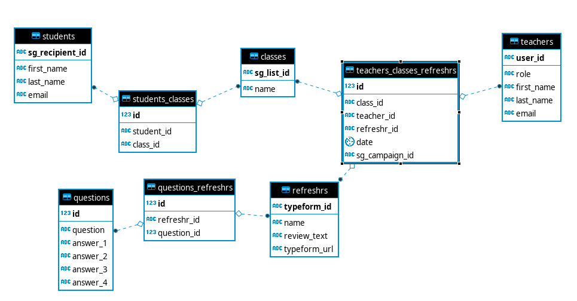

# [Refreshr App Frontend](https://refreshr-app.netlify.com) (Lambda School Labs 10)


- [App Client Home](https://refreshr-app.netlify.com)
- [Backend Base URL](https://refreshr.herokuapp.com/)
- [Refreshr Video Reel](https://youtu.be/D_KNyY7LiD0)
---

## Contributors

- **Chaya Otikor** | [Github](https://github.com/cotikor)

- **Justin Lowry** | [Github](https://github.com/dividedsky) | [LinkedIn](https://www.linkedin.com/in/justin-lowry-792960180/)

- **Nick O'Ferrall** | [Github](https://github.com/nickoferrall) | [LinkedIn](https://www.linkedin.com/in/nickoferrall/)

- **Sawyer Zincone** | [Github](https://github.com/szincone) | [LinkedIn](https://www.linkedin.com/in/szincone/)

- **Timothy Hoang** | [Github](https://github.com/timh1203) | [LinkedIn](https://www.linkedin.com/in/timothyhoang/)

---

## Project Overview

```
Learning is difficult. Teaching is hard. When learners have small triggers to remember content over a spread out period of time they retain more. Send customizable refreshrs at scheduled intervals after the initial lecture.
```

- `Refreshr` aims to help students retain information through the spaced-learning method with periodic, scheduled quizzes called "refreshrs"
- Students receive a "refreshr" with a short introductory review paragraph, a multiple choice question, and a short answer question all contained within a nice easy to follow format provided by the Typeform service
- The app schedules refreshrs to be sent out via email during specified times (2 days, 2 weeks, and 2 months) via the enterprise level mailing service called Sendgrid
- This project was designed for our Lambda School Labs 10 Capstone Project

### Key Features

```md
- Create a class and manage students in the class
- Create and edit Refreshrs to be sent out
- Assign a Refreshr to a class
- Schedule and automate delivery of refreshrs
- The Refreshrs automatically get delivered via email
- Auth0 is used to sign into the app
- Stripe is used to handle credit cards
```

---

## Tech Stack

### Frontend

```md
# React (JavaScript Frontend Library)

- React features reusable components, fast rendering with the virtual DOM, great ecosystem with plugins, and state-management in the component
```

```md
# React Hooks (Library Feature)

- React Hooks a new stable feature as of the v16.8 release
- Features the ability of functional components to have state and various life-cycle methods
```

```md
# Material-UI Library (Styling Library)

- MUI features a professional UI, lends credibility due to having a similar look to other google sites, and prevent global CSS leaks
- Self-supporting components, open-sourced, and disinctive look
- Library complete with icons, color, typography, layouts, breakpoints, and more
```

### Backend

```md
# NodeJS (JavaScript Backend Library)

- NodeJS features V8 JavaScript engine, particularly well suited to live updates, and has a robust NodeJS ecosystem
```

```md
# ExpressJS (Server framework for NodeJS)

- ExpressJS is a library built to optimize operations on top of the NodeJS language
```

```md
# PostgreSQL (Relational Database)

- PostgreSQL is a production grade database, blends well with deployment technology, great documentation, widely used, second most popular database package on npm
```

#### Data Model



### Deployment

```md
# Netlify

- Features complete services for deployment including automated deployment, continuous integration, HTTPS secured with free TLS certificate
- Multi-cloud infrastructure designed for speed, automated to scale, and intrinsically secure
- Tool-agnostic platform allows for freedom of addons and tools
- Has dynamic functionality with built-in applications like HTML forms
```

```md
# Heroku

- Well-known service, reliable support, and well-documented
- Works with many backend languages: NodeJS, Ruby, PHP, Python, and others
- Features rich system of third party addons and open-sourced buildpacks
- Simple to scale horizontally or vertically
```

### API/Services

```md
# Sendgrid
- Sendgrid is an email service, part of the Twilio company, which gives developers access to the Sendgrid V3 API to control email campaigns, set lists, set senders, set recipients, and many other features.
- Our purposes with Refreshr is to use it to schedule refreshrs and to email students out with a magic link back to our platform in order to take their refreshr.
- [Sendgrid V3 Documentation](https://sendgrid.api-docs.io/v3.0)
```

```md
# Typeform
- Creates interactive experiences for users and collect more data
- The beautiful forms are presented in a conversational format to foster a friendly experience that invites more answers
- With our app, the typeform invites our students to take the refreshr with order so they don't get overwhelmed
- [Typeform's Developer Platform](https://developer.typeform.com/)
```

```md
# Papa Parse
- Fast javascript CSV parser for the browser
- Abiliy to parse local files, remote files
- Convert JSON to CSV
- Helps convert student's informations in the Refreshr app
- [Papa Parse Home](https://www.papaparse.com/)
```


```
# Other APIs
- Auth0 - authorization and authentication service
- Stripe - payment portal service
- Axios - promise based HTTP client for the browser and NodeJS
- Knex - SQL Query Builder for Javascript
- Jest/React-Testing-Library/Jest-Dom - testing libraries
- Dotenv - load local environment variables for env
- Cors - cross origin bridge
- Faker - simulates fake data
- MomentJS - package to work with time data
- React Lazy Load Image Component - package with placeholder and image loading features
```

---

## Environment Variables

```md
SENDGRID_API_KEY=Obtain key from API (Source: https://app.sendgrid.com/settings/api_keys)
REACT_APP_TYPEFORM=Obtain key from API (Source: https://developer.typeform.com)
```

---

## Testing

```md
# Jest

# Jest-Dom

# React Testing Library

- React Testing Library is a simple and complete React DOM testing utilities that encourage good testing practices
- The guiding principle: The more your tests resemble the way your software is used, the more confidence [the tests] can give you
- This tool was designed to work alongside Jest and Mocha, not to replace them
- React Testing Library is less opinionated than Enzyme and makes the testing process more developer-friendly, this library can also replace Enzyme
- Write tests for React components that avoid including implementation details
- Maintain your tests so it won't break tests or slow down the team even with code refactoring when making changes to implementation but not functionality
```

---

## Contributions/Issues/Bugs

### Would you like to report an issue/bug?

- Please post to the [issues section](https://github.com/Lambda-School-Labs/labs10-student-follow/issues) on our github repo as it helps us track of all tasks, enhancements, and bugs for the project!
- Some guidelines can be found in this [document](https://github.com/necolas/issue-guidelines/blob/master/CONTRIBUTING.md#bugs).

```md
# How do you use the issues section?

- By using "@mentions" and references inside of issues, you can notify other GitHub users & teams, and even cross-connect issues to each other.
- "Title" and "Description" - decribes what the issue is all about
- "Labels" - helps categorize and filter issues
- "Milestone" - acts as a container for issues like Beta Launch, October Sprint, or Redesign
- "Assignee" - developer responsible for working on the issue
- "Comments" - allows anyone with access to the repository to provide feedback
```

### Would you like to contribute to the repository?

- In short, please ask first before embarking on any significant pull request
- Good pull requests - patches, improvements, new features - are a fantastic help. They should remain focused in scope and avoid containing unrelated commits.
- Please follow the guidelines set out by this [document](https://github.com/necolas/issue-guidelines/blob/master/CONTRIBUTING.md#pull-requests).

#### Source: https://guides.github.com/features/issues/

---

## Additional Documentation

- For the backend documentation, please visit [Backend Documentation](https://github.com/Lambda-School-Labs/labs10-student-follow/blob/master/README.md).
